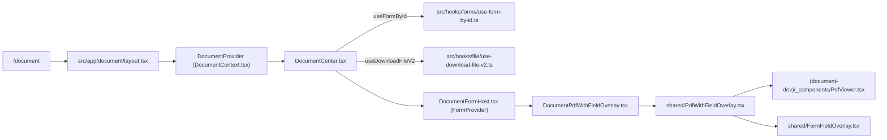

# 서식(Document) 기능 구조 문서

이 문서는 **서식 기능을 한 눈에 파악**하고, 문제/기능 추가/개선 작업 시 **어느 파일을 어디부터 확인해야 하는지** 빠르게 찾기 위한 문서입니다.

## 범위
- **실제 사용자 서식 화면**: `/document` (PDF 서식 렌더 + 필드 오버레이)
- **개발용 서식 편집기**: `/field-editor` (`(document-dev)` 경로)

## 핵심 개념(용어)
- **Form(서식)**: 서버에서 내려오는 서식 정의(필드, PDF 파일 정보, 렌더 타입 등)
- **FormFieldDto**: 서버 스키마의 필드 정의 타입 (`components['schemas']['FormFieldDto']`)
- **RHF(react-hook-form)**: 서식 필드 값 상태 관리/입력 처리
- **렌더 타입**: PDF 기반(`FormRenderType.Pdf`) vs 컴포넌트 기반(`FormRenderType.Component`)
- **오버레이**: PDF 위에 필드 입력/표시를 absolute 배치로 렌더링하는 영역

---

## 전체 호출 흐름(사용자 화면)

### 1) 라우팅/프로바이더 구성
- **엔트리**
  - `src/app/document/page.tsx`: 실제 렌더는 `layout.tsx`가 담당(페이지는 `null` 반환)
- **레이아웃**
  - `src/app/document/layout.tsx`
    - `<DocumentProvider>`로 컨텍스트 제공
    - 좌측(LNB)/중앙/우측(RNB) 패널과 툴바를 구성
    - URL 파라미터(`patientId`, `encounterId`, `documentId`) 기반 초기 선택 처리

### 2) 문서(서식) 선택 → 서식 상세 조회 → PDF 다운로드 → 렌더 상태 결정
- **중앙 패널(렌더 상태 머신)**
  - `src/app/document/_components/DocumentCenter.tsx`
    - `useFormById(formId, patientId)`로 서식 상세 조회
      - `src/hooks/forms/use-form-by-id.ts`
      - 내부에서 `FormsService.getFormById(...)`/`getFormByIdWithPatient(...)` 호출
        - `src/services/forms-service.ts`
    - PDF 렌더 타입이면 `pdfUuid`를 추출하고 다운로드
      - `useDownloadFileV2(pdfUuid)` → `FileService.downloadFileV2(uuid)`
        - `src/hooks/file/use-download-file-v2.ts`
        - `src/services/file-service.ts`
    - 다운로드된 `blob`으로 `URL.createObjectURL()` 생성 후 `renderState`를 `Pdf`로 설정
    - `renderState`에 따라:
      - PDF: `DocumentPdfWithFieldOverlay` 렌더
      - Component: `resolveFormComponent`로 컴포넌트 렌더
      - Loading/Error/Idle: 상태 화면 렌더

### 3) 폼 값(host) 초기화 및 값 해결기(resolver) 적용
- **RHF 호스트**
  - `src/app/document/_components/DocumentFormHost.tsx`
    - `useForm({ defaultValues: initialFormData })`
    - 컨텍스트 ref 등록
      - `formSnapshotRef`(스냅샷), `formResetRef`, `formDirtyRef`, `formSetValueRef`
    - `initialFormData` 변경 시 `reset(initialFormData)`
    - **발급본이 없고 PDF 렌더 타입이면** `resolveFieldValue`로 동적 값(내원이력 등) 주입
      - `src/lib/field-value-resolvers.ts`

### 4) PDF + 필드 오버레이 렌더링(공용 렌더러)
- **문서 화면 어댑터**
  - `src/app/document/_components/DocumentPdfWithFieldOverlay.tsx`
    - `DocumentContext`에서 `currentPage`, `setCurrentPage`, `setTotalPages`, `formMode` 등 가져옴
    - 공용 컴포넌트 `PdfWithFieldOverlay` 호출
- **공용 PDF 래퍼**
  - `src/app/document/_components/shared/PdfWithFieldOverlay.tsx`
    - `PdfViewer`로 PDF 페이지 렌더
      - `src/app/(document-dev)/_components/PdfViewer.tsx` (react-pdf 기반)
    - `onPageLoad`로 PDF size 확보(`width/height/scale`)
    - 준비 완료 시 `FormFieldOverlay` 렌더
- **공용 오버레이**
  - `src/app/document/_components/shared/FormFieldOverlay.tsx`
    - RHF(`useFormContext`) 기반으로 필드 값 표시/입력 처리
    - 체크박스/라디오 그룹, 총점(scoreGroup), 진단테이블, STAMP(이미지) 등 처리
    - 문서 화면에서는 `appliedEncounters`, `lastFocusedFieldRef`를 주입하여 기능 활성화

---

## 핵심 로직별 “어디를 봐야 하는가”

### A) PDF 렌더링(페이지/로딩/크기 측정)
- **파일**: `src/app/document/_components/shared/PdfWithFieldOverlay.tsx`
- **핵심 이벤트**
  - `onPageLoad` → pdfSize 업데이트(오버레이 크기 동기화)
  - `onNumPagesChange` → `onTotalPagesChange(pages)` 호출(문서 컨텍스트의 totalPages로 연결)
  - `onLoadingChange` → 준비 전 콘텐츠 숨김 처리(깜빡임 방지)

### B) 필드 렌더링(보기/편집) + RHF 값 연동
- **파일**: `src/app/document/_components/shared/FormFieldOverlay.tsx`
- **호출 경로**
  - `DocumentCenter` → `DocumentFormHost(FormProvider)` → `DocumentPdfWithFieldOverlay` → `PdfWithFieldOverlay` → `FormFieldOverlay`
- **체크박스/라디오**
  - 라디오 그룹은 `radioGroup_${groupName}` 키로 RHF에 저장(하나만 선택)
  - 일반 체크박스는 `field.key`가 boolean
- **scoreGroup 총점 계산**
  - `useEffect(updateScoresOnCheckboxChange)`에서 `watch` subscription으로 변경 감지
  - `calculateScoreGroupTotal()`로 합산 후 `setValue(totalField.key, total)`
- **진단테이블(DIAGNOSIS_TABLE) 자동 동기화**
  - `useEffect(syncDiagnosisTableWithEncounters)`에서 `appliedEncounters` 기반으로 rows 생성 후 `setValue(field.key, rows)`
- **STAMP**
  - `useFileObjectUrl(uuid)`로 이미지 다운로드 후 표시
  - uuid가 없을 때는 `stampPlaceholder`가 주어지면 텍스트로 대체 표시 가능

### C) 폼 초기값/발급본/스냅샷 매핑
- **문서 컨텍스트 초기값 계산**
  - `src/app/document/_contexts/DocumentContext.tsx`
    - 발급본이 있으면 `mapFormDataToSnapshot(loadedIssuance.formData)`로 values 추출
      - `src/app/document/_utils/form-data-mapper.ts`
    - 새 발급/빈 서식이면 `buildRhfDefaultsFromFields(fields)`로 defaultValue 토큰 처리
      - `src/app/document/_utils/form-initialization.ts`
- **값 해결기(Value Resolver)**
  - `src/lib/field-value-resolvers.ts`
    - `resolveFieldValue(field, { appliedEncounters, selectedPatient })`
    - resolver 키는 `ValueResolver` enum에 정의되어야 함

---

## 개발용 편집기(`/field-editor`) 구조

### 1) 페이지 구성
- **파일**: `src/app/(document-dev)/field-editor/page.tsx`
- **흐름**
  - `PdfViewer`로 PDF 렌더
  - Konva 기반 오버레이로 필드 위치/크기 편집
    - `src/app/(document-dev)/_components/FieldOverlay.tsx`
  - 미리보기 패널을 토글로 표시
    - `src/app/(document-dev)/_components/FieldEditorPreviewPanel.tsx`

### 2) 편집 상태(Context)
- **파일**: `src/app/(document-dev)/_contexts/FieldEditorContext.tsx`
- **역할**
  - `addedFields`(필드 정의), 페이지, PDF 파일, 서버 로드/업데이트 등 상태/행동 제공
  - 서버 서식 불러오기/업데이트 시 필드 변환 유틸 사용

### 3) 미리보기(실제 렌더러 재사용 + view/edit 토글)
- **파일**: `src/app/(document-dev)/_components/FieldEditorPreviewPanel.tsx`
- **핵심 포인트**
  - `AddedField[]` → `FormFieldDto[]` 변환 후 공용 `PdfWithFieldOverlay`로 렌더
  - `react-hook-form`을 패널 내부에 두어 **패널 열림 동안 값 유지**
  - 상단 토글로 `view/edit` 전환
  - STAMP는 `stampPlaceholder="[직인]"`로 대체 표시

### 4) 필드 변환/미리보기 더미 값 유틸
- **AddedField ↔ FormFieldDto 변환**
  - `src/app/(document-dev)/_utils/field-conversion.ts`
    - `convertAddedFieldsToFormFields(fields, fieldIdMap)`
    - `convertFormFieldsToAddedFields(fields)`
- **미리보기 더미 값 생성**
  - `src/app/(document-dev)/_utils/preview-form-defaults.ts`
    - `buildPreviewDefaultsFromFields(fields)`
    - 라디오 그룹 기본 선택/체크박스 기본 체크/일부 dataSource 기반 더미 값 주입

---

## “이슈가 생기면 여기부터” 체크리스트

- **PDF가 안 보인다 / 로딩이 끝나지 않는다**
  - `src/app/document/_components/shared/PdfWithFieldOverlay.tsx`
  - `src/app/(document-dev)/_components/PdfViewer.tsx`
  - `src/hooks/file/use-download-file-v2.ts` → `src/services/file-service.ts`

- **필드가 안 뜬다 / 위치가 이상하다**
  - `src/app/document/_components/shared/FormFieldOverlay.tsx`
  - 필드 정의값(`x/y/width/height/pageNumber`)이 올바른지 확인

- **edit 모드 입력이 반영이 안 된다**
  - `src/app/document/_components/DocumentFormHost.tsx` (FormProvider/초기화/reset)
  - `src/app/document/_components/shared/FormFieldOverlay.tsx` (register/Controller/watch)

- **라디오/총점/진단테이블 자동 계산이 이상하다**
  - `src/app/document/_components/shared/FormFieldOverlay.tsx`
    - `radioGroup_${name}` 키 규칙
    - scoreGroup 합산 로직
    - DIAGNOSIS_TABLE appliedEncounters 동기화

- **내원이력 기반 값이 안 채워진다**
  - `src/lib/field-value-resolvers.ts`
  - `src/app/document/_components/DocumentFormHost.tsx`의 `applyValueResolvers` 조건(발급본 있으면 스킵 등)

- **field-editor 미리보기(view/edit)만 이상하다**
  - `src/app/(document-dev)/_components/FieldEditorPreviewPanel.tsx`
  - `src/app/(document-dev)/_utils/preview-form-defaults.ts`

---

## 호출 경로 다이어그램(요약)

